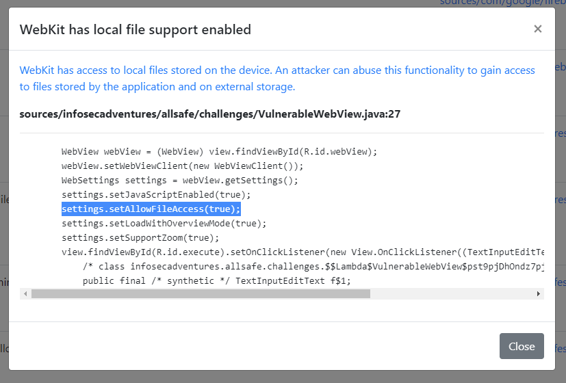

# Aparoid

[](https://www.python.org/downloads/)
[](https://github.com/stefan2200/aparoid/)

Aparoid is a framework designed for Android application analysis. It offers an automated set of tools to discover vulnerabilities and other risks in mobile applications.
It is built using the Flask framework and offers a web GUI to upload APK files and explore the contents / results.

The current version offers the following features:

- APK decompilation using jadx
- Vulnerability detection system (rules configurable using the dashboard)
- Binary file risk analysis
- Custom features for frameworks like React Native, Flutter and Xamarin
- Android Manifest security checks
- Dynamic analysis on all (rooted) Android devices (physical, emulated and cloud based)
- Frida scripts for the bypass of root detection, SSL pinning and debugger detection (custom scripts are also supported)
- Automatic installation of a root CA certificate (also supports Burp Suite)
- HTTP(S) interception proxy and real-time traffic viewer using Kafka
- Real-time application stored data browser

## Installing
```shell
git clone https://github.com/stefan2200/aparoid
cd aparoid
docker-compose up
```

Local version

```shell
sudo apt-get install python3 python3-pip sqlite3 default-jre android-tools-adb gunicorn libmagic1
git clone https://github.com/stefan2200/aparoid
cd aparoid
python3 -m pip install --upgrade requirements.txt

# Start the server on port 7300
./start.sh
```

Optionally, it is recommended to install Kafka if you want to use most of the dynamic analysis features.

```shell
cd collector
docker-compose up -d
```

## Aparoid features

Aparoid checks for a lot of code vulnerabilities and issues.


A list of vulnerabilities can be browsed with followable references to the source code.



Additionally, it also analyses native binaries for hardening techniques and gives some information on how the technique can improve security.


The static code analysis engine offers an easy-to-use database system to add or maintain static code vulnerabilities.


One of the most awesome features is the option to automatically create frida patches based on the decompiled source code.


The dynamic analyser can be used to enumerate, install and instrument installed applications.
Additionally, this is also where you can automatically install the correct frida version for your device.


Once you have selected a package you can control frida scripts and route all of the application's traffic trough a proxy server.
Aperoid uses mitmproxy by default to intercept traffic and log it to Kafka.


The dynamic page also offers functionality to browse the application data real-time. 

